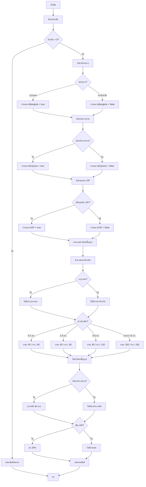

# อัลกอริทึมระบบคำนวณค่าจัดส่งสินค้า

## ผังงาน (Flowchart)



## รหัสเทียม (Pseudo Code)

```
อัลกอริทึม ระบบคำนวณค่าจัดส่งสินค้า

ค่าคงที่:
    // อัตราค่าจัดส่งกรุงเทพฯ และปริมณฑล
    อัตรา_กทม_0_1กก = 40
    อัตรา_กทม_1_3กก = 60
    อัตรา_กทม_3_5กก = 80
    อัตรา_กทม_มากกว่า5กก = 100
    
    // อัตราค่าจัดส่งต่างจังหวัด
    อัตรา_ตจว_0_1กก = 60
    อัตรา_ตจว_1_3กก = 90
    อัตรา_ตจว_3_5กก = 120
    อัตรา_ตจว_มากกว่า5กก = 150
    
    // ค่าบริการเพิ่มเติมและส่วนลด
    ค่าบริการด่วน = 30
    ส่วนลด_VIP = 0.20

เริ่มต้น โปรแกรมหลัก
    แสดง "ระบบคำนวณค่าจัดส่งสินค้า"
    
    // รับข้อมูลจากผู้ใช้
    รับค่า น้ำหนัก
    
    ถ้า น้ำหนัก <= 0 แล้ว
        แสดง "ข้อผิดพลาด: น้ำหนักต้องมากกว่า 0 กิโลกรัม"
        ออกจากโปรแกรม
    สิ้นสุดถ้า
    
    แสดง "เลือกปลายทาง:"
    แสดง "1. กรุงเทพฯ และปริมณฑล"
    แสดง "2. ต่างจังหวัด"
    รับค่า ตัวเลือกปลายทาง
    
    เป็นกรุงเทพ = (ตัวเลือกปลายทาง == 1)
    
    รับค่า ตัวเลือกบริการด่วน
    เป็นบริการด่วน = (ตัวเลือกบริการด่วน == 1)
    
    รับค่า ตัวเลือกVIP
    เป็นVIP = (ตัวเลือกVIP == 1)
    
    // คำนวณค่าจัดส่ง
    ค่าจัดส่ง = เรียก คำนวณค่าจัดส่ง(น้ำหนัก, เป็นกรุงเทพ, เป็นบริการด่วน, เป็นVIP)
    
    // แสดงผลลัพธ์
    เรียก แสดงผลลัพธ์(น้ำหนัก, เป็นกรุงเทพ, เป็นบริการด่วน, เป็นVIP, ค่าจัดส่ง)
สิ้นสุด โปรแกรมหลัก


ฟังก์ชัน คำนวณค่าพื้นฐาน(น้ำหนัก, เป็นกรุงเทพ)
    ถ้า เป็นกรุงเทพ แล้ว
        // อัตรากรุงเทพฯ และปริมณฑล
        ถ้า น้ำหนัก <= 1 แล้ว
            คืนค่า อัตรา_กทม_0_1กก        // 40 บาท
        มิฉะนั้นถ้า น้ำหนัก <= 3 แล้ว
            คืนค่า อัตรา_กทม_1_3กก        // 60 บาท
        มิฉะนั้นถ้า น้ำหนัก <= 5 แล้ว
            คืนค่า อัตรา_กทม_3_5กก        // 80 บาท
        มิฉะนั้น
            คืนค่า อัตรา_กทม_มากกว่า5กก   // 100 บาท
        สิ้นสุดถ้า
    มิฉะนั้น
        // อัตราต่างจังหวัด
        ถ้า น้ำหนัก <= 1 แล้ว
            คืนค่า อัตรา_ตจว_0_1กก        // 60 บาท
        มิฉะนั้นถ้า น้ำหนัก <= 3 แล้ว
            คืนค่า อัตรา_ตจว_1_3กก        // 90 บาท
        มิฉะนั้นถ้า น้ำหนัก <= 5 แล้ว
            คืนค่า อัตรา_ตจว_3_5กก        // 120 บาท
        มิฉะนั้น
            คืนค่า อัตรา_ตจว_มากกว่า5กก   // 150 บาท
        สิ้นสุดถ้า
    สิ้นสุดถ้า
สิ้นสุด ฟังก์ชัน


ฟังก์ชัน คำนวณค่าจัดส่ง(น้ำหนัก, เป็นกรุงเทพ, เป็นบริการด่วน, เป็นVIP)
    // ขั้นตอนที่ 1: คำนวณค่าพื้นฐานตามน้ำหนักและปลายทาง
    ค่ารวม = เรียก คำนวณค่าพื้นฐาน(น้ำหนัก, เป็นกรุงเทพ)
    
    // ขั้นตอนที่ 2: บวกค่าบริการด่วน (ถ้าเลือก)
    ถ้า เป็นบริการด่วน แล้ว
        ค่ารวม = ค่ารวม + ค่าบริการด่วน    // +30 บาท
    สิ้นสุดถ้า
    
    // ขั้นตอนที่ 3: หักส่วนลด VIP (ถ้าเป็นสมาชิก)
    ถ้า เป็นVIP แล้ว
        ค่ารวม = ค่ารวม × (1 - ส่วนลด_VIP)    // -20%
    สิ้นสุดถ้า
    
    คืนค่า ค่ารวม
สิ้นสุด ฟังก์ชัน


ฟังก์ชัน แสดงผลลัพธ์(น้ำหนัก, เป็นกรุงเทพ, เป็นบริการด่วน, เป็นVIP, ค่ารวม)
    แสดง "===== รายละเอียดค่าจัดส่ง ====="
    แสดง "น้ำหนักสินค้า: " + น้ำหนัก + " กิโลกรัม"
    แสดง "ปลายทาง: " + (เป็นกรุงเทพ ? "กรุงเทพฯ และปริมณฑล" : "ต่างจังหวัด")
    แสดง "บริการด่วน: " + (เป็นบริการด่วน ? "ใช่ (+30 บาท)" : "ไม่")
    แสดง "สมาชิก VIP: " + (เป็นVIP ? "ใช่ (ลด 20%)" : "ไม่")
    แสดง "ค่าจัดส่งรวม: " + ค่ารวม + " บาท"
สิ้นสุด ฟังก์ชัน

สิ้นสุด อัลกอริทึม
```

## ตารางสรุปอัตราค่าจัดส่ง

| ช่วงน้ำหนัก | กรุงเทพฯ และปริมณฑล | ต่างจังหวัด |
|-------------|---------------------|-------------|
| 0 - 1 กก.   | 40 บาท              | 60 บาท      |
| > 1 - 3 กก. | 60 บาท              | 90 บาท      |
| > 3 - 5 กก. | 80 บาท              | 120 บาท     |
| > 5 กก.     | 100 บาท             | 150 บาท     |

## ค่าบริการเพิ่มเติม

| ตัวเลือก      | ผลกระทบ                |
|---------------|------------------------|
| บริการด่วน    | + 30 บาท               |
| สมาชิก VIP    | ลด 20% จากค่าจัดส่งรวม |

## ตัวอย่างการคำนวณ

**ข้อมูลนำเข้า:**
- น้ำหนัก: 2.5 กิโลกรัม
- ปลายทาง: กรุงเทพฯ และปริมณฑล
- บริการด่วน: ใช่
- สมาชิก VIP: ใช่

**ขั้นตอนการคำนวณ:**
1. ค่าจัดส่งพื้นฐาน (1-3 กก., กรุงเทพฯ) = 60 บาท
2. บวกค่าบริการด่วน = 60 + 30 = 90 บาท
3. หักส่วนลด VIP 20% = 90 × 0.80 = **72 บาท**
