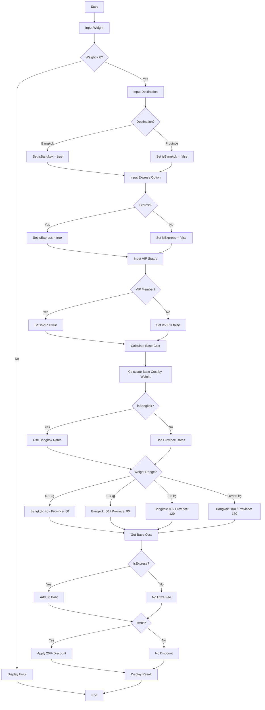

# Shipping Cost Calculator Algorithm

## Flowchart



## Pseudo Code

```
ALGORITHM ShippingCostCalculator

CONSTANTS:
    // Bangkok & Surrounding Areas Rates
    BANGKOK_RATE_0_1KG = 40
    BANGKOK_RATE_1_3KG = 60
    BANGKOK_RATE_3_5KG = 80
    BANGKOK_RATE_OVER_5KG = 100
    
    // Provincial Rates
    PROVINCE_RATE_0_1KG = 60
    PROVINCE_RATE_1_3KG = 90
    PROVINCE_RATE_3_5KG = 120
    PROVINCE_RATE_OVER_5KG = 150
    
    // Service Fees & Discounts
    EXPRESS_FEE = 30
    VIP_DISCOUNT = 0.20

BEGIN MAIN
    DISPLAY "Shipping Cost Calculator"
    
    // Get user inputs
    INPUT weight
    
    IF weight <= 0 THEN
        DISPLAY "Error: Weight must be greater than 0"
        EXIT
    END IF
    
    DISPLAY "Select Destination:"
    DISPLAY "1. Bangkok & Surrounding Areas"
    DISPLAY "2. Other Provinces"
    INPUT destinationChoice
    
    isBangkok = (destinationChoice == 1)
    
    INPUT expressChoice
    isExpress = (expressChoice == 1)
    
    INPUT vipChoice
    isVIP = (vipChoice == 1)
    
    // Calculate shipping cost
    shippingCost = CALL calculateShippingCost(weight, isBangkok, isExpress, isVIP)
    
    // Display result
    CALL displayResult(weight, isBangkok, isExpress, isVIP, shippingCost)
END MAIN


FUNCTION getBaseCost(weight, isBangkok)
    IF isBangkok THEN
        // Bangkok & Surrounding Areas
        IF weight <= 1 THEN
            RETURN BANGKOK_RATE_0_1KG      // 40 Baht
        ELSE IF weight <= 3 THEN
            RETURN BANGKOK_RATE_1_3KG      // 60 Baht
        ELSE IF weight <= 5 THEN
            RETURN BANGKOK_RATE_3_5KG      // 80 Baht
        ELSE
            RETURN BANGKOK_RATE_OVER_5KG   // 100 Baht
        END IF
    ELSE
        // Other Provinces
        IF weight <= 1 THEN
            RETURN PROVINCE_RATE_0_1KG     // 60 Baht
        ELSE IF weight <= 3 THEN
            RETURN PROVINCE_RATE_1_3KG     // 90 Baht
        ELSE IF weight <= 5 THEN
            RETURN PROVINCE_RATE_3_5KG     // 120 Baht
        ELSE
            RETURN PROVINCE_RATE_OVER_5KG  // 150 Baht
        END IF
    END IF
END FUNCTION


FUNCTION calculateShippingCost(weight, isBangkok, isExpress, isVIP)
    // Step 1: Get base cost based on weight and destination
    totalCost = CALL getBaseCost(weight, isBangkok)
    
    // Step 2: Add express fee if selected
    IF isExpress THEN
        totalCost = totalCost + EXPRESS_FEE    // +30 Baht
    END IF
    
    // Step 3: Apply VIP discount if applicable
    IF isVIP THEN
        totalCost = totalCost * (1 - VIP_DISCOUNT)    // -20%
    END IF
    
    RETURN totalCost
END FUNCTION


FUNCTION displayResult(weight, isBangkok, isExpress, isVIP, totalCost)
    DISPLAY "===== Shipping Details ====="
    DISPLAY "Weight: " + weight + " kg"
    DISPLAY "Destination: " + (isBangkok ? "Bangkok" : "Province")
    DISPLAY "Express Service: " + (isExpress ? "Yes (+30)" : "No")
    DISPLAY "VIP Member: " + (isVIP ? "Yes (-20%)" : "No")
    DISPLAY "Total Shipping Cost: " + totalCost + " Baht"
END FUNCTION

END ALGORITHM
```

## Pricing Summary Table

| Weight Range | Bangkok & Surrounding | Other Provinces |
|--------------|----------------------|-----------------|
| 0 - 1 kg     | 40 Baht              | 60 Baht         |
| > 1 - 3 kg   | 60 Baht              | 90 Baht         |
| > 3 - 5 kg   | 80 Baht              | 120 Baht        |
| > 5 kg       | 100 Baht             | 150 Baht        |

## Additional Modifiers

| Option          | Effect              |
|-----------------|---------------------|
| Express Service | + 30 Baht           |
| VIP Member      | - 20% of total cost |

## Calculation Example

**Input:**
- Weight: 2.5 kg
- Destination: Bangkok
- Express: Yes
- VIP: Yes

**Calculation:**
1. Base Cost (1-3 kg, Bangkok) = 60 Baht
2. Add Express Fee = 60 + 30 = 90 Baht
3. Apply VIP Discount = 90 × 0.80 = **72 Baht**
