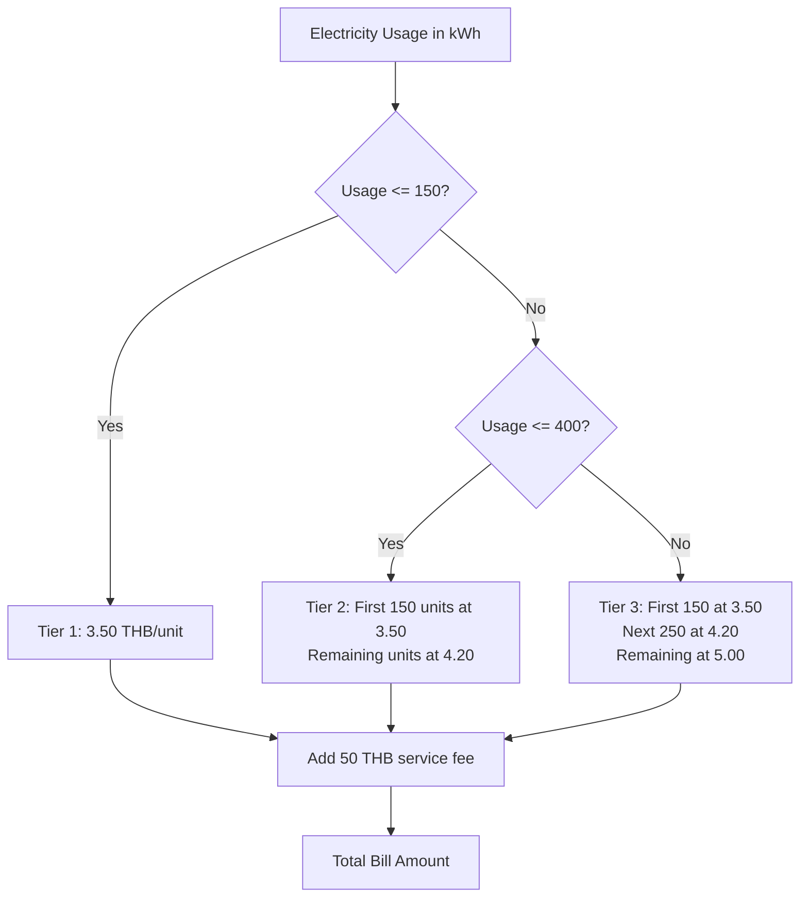

# Flowchart for Electricity Bill Calculator

## Complete Program Flow

```mermaid
flowchart TD
    A[Start] --> B[Initialize Scanner]
    B --> C[Prompt user: Enter kWh usage]
    C --> D[Read input as units]
    D --> E[Call calculateElectricityBill(units)]
    E --> F[Check: units <= 0?]
    F -->|Yes| G[Return 0]
    F -->|No| H[Check: units <= 150?]
    H -->|Yes| I[Amount = units * 3.50]
    H -->|No| J[Check: units <= 400?]
    J -->|Yes| K[Amount = (150 * 3.50) + ((units-150) * 4.20)]
    J -->|No| L[Amount = (150 * 3.50) + (250 * 4.20) + ((units-400) * 5.00)]
    I --> M[Add service fee: Amount + 50]
    K --> M
    L --> M
    G --> N[Display result]
    M --> N
    N --> O[Call showCalculationBreakdown]
    O --> P[Close Scanner]
    P --> Q[End]
```

## Tier Pricing Structure



## Process Steps

1. **Input Collection**: Prompt user and read electricity usage in kWh
2. **Tier Determination**: Check which pricing tier the usage falls into
3. **Calculation**: Apply the appropriate rate based on usage tiers
4. **Service Fee**: Add the fixed 50 THB service fee
5. **Output**: Display the total bill amount with breakdown
6. **Cleanup**: Close the scanner resource

## Pricing Tiers

- **Tier 1**: 0-150 kWh → 3.50 THB/unit
- **Tier 2**: 151-400 kWh → 4.20 THB/unit (on units above 150)
- **Tier 3**: 401+ kWh → 5.00 THB/unit (on units above 400)
- **Service Fee**: Fixed 50 THB added to all bills