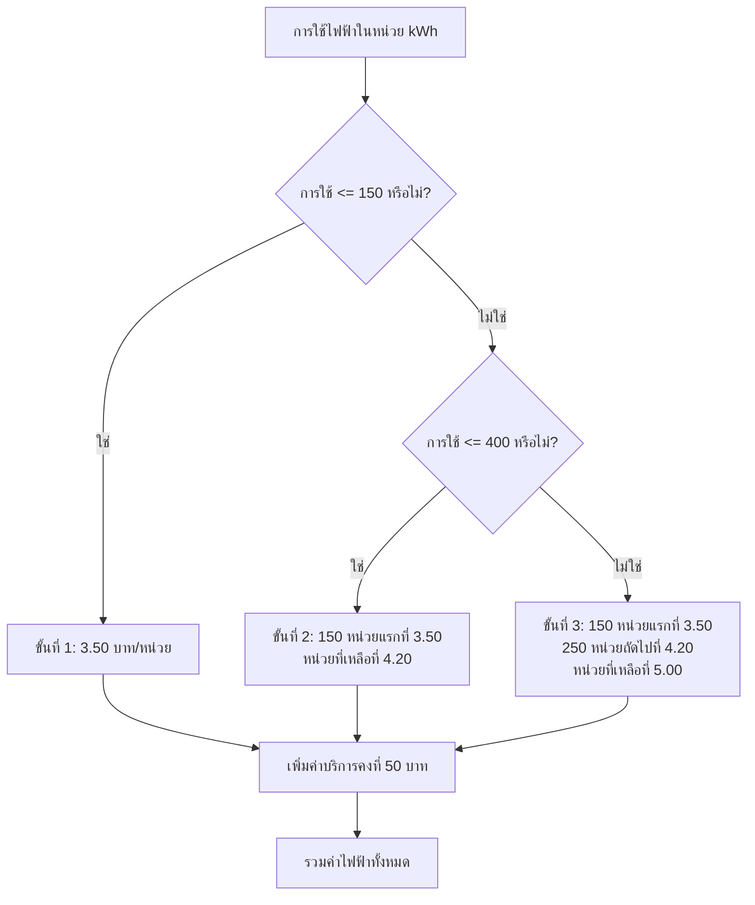

# ผังงานโปรแกรมคำนวณค่าไฟฟ้า

## ผังงานโปรแกรมหลัก

```mermaid
flowchart TD
    A[เริ่มต้น] --> B[สร้างออบเจกต์ Scanner]
    B --> C[แสดงข้อความ: กรุณากรอกจำนวนหน่วยการใช้ไฟฟ้า]
    C --> D[อ่านค่าที่ผู้ใช้ป้อนเป็นจำนวนหน่วย]
    D --> E[เรียกเมทอด calculateElectricityBill(หน่วย)]
    E --> F[ตรวจสอบ: หน่วย <= 0 หรือไม่?]
    F -->|ใช่| G[คืนค่า 0]
    F -->|ไม่ใช่| H[ตรวจสอบ: หน่วย <= 150 หรือไม่?]
    H -->|ใช่| I[จำนวนเงิน = หน่วย * 3.50]
    H -->|ไม่ใช่| J[ตรวจสอบ: หน่วย <= 400 หรือไม่?]
    J -->|ใช่| K[จำนวนเงิน = (150 * 3.50) + ((หน่วย-150) * 4.20)]
    J -->|ไม่ใช่| L[จำนวนเงิน = (150 * 3.50) + (250 * 4.20) + ((หน่วย-400) * 5.00)]
    I --> M[เพิ่มค่าบริการ: จำนวนเงิน + 50]
    K --> M
    L --> M
    G --> N[แสดงผลลัพธ์]
    M --> N
    N --> O[เรียกเมทอด showCalculationBreakdown]
    O --> P[ปิดออบเจกต์ Scanner]
    P --> Q[จบโปรแกรม]
```

## โครงสร้างอัตราค่าไฟฟ้า



## ขั้นตอนการทำงาน

1. **รับข้อมูล**: แสดงข้อความและอ่านจำนวนหน่วยการใช้ไฟฟ้าจากผู้ใช้
2. **กำหนดช่วงราคา**: ตรวจสอบว่าการใช้งานอยู่ในช่วงราคาใด
3. **คำนวณ**: ใช้อัตราค่าไฟฟ้าที่เหมาะสมตามช่วงการใช้งาน
4. **ค่าบริการ**: เพิ่มค่าบริการคงที่ 50 บาท
5. **แสดงผล**: แสดงจำนวนเงินรวมพร้อมรายละเอียดการคำนวณ
6. **ปิดระบบ**: ปิดออบเจกต์ Scanner

## โครงสร้างอัตราค่าไฟฟ้า

- **ขั้นที่ 1**: 0-150 kWh → 3.50 บาท/หน่วย
- **ขั้นที่ 2**: 151-400 kWh → 4.20 บาท/หน่วย (สำหรับหน่วยที่เกิน 150 หน่วย)
- **ขั้นที่ 3**: 401+ kWh → 5.00 บาท/หน่วย (สำหรับหน่วยที่เกิน 400 หน่วย)
- **ค่าบริการ**: ค่าบริการคงที่ 50 บาท เพิ่มในทุกบิล